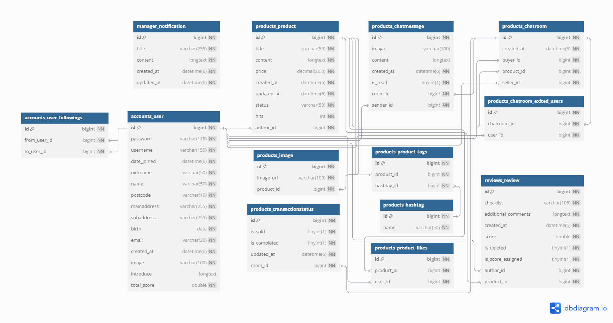

# 🍓StrawBerryMarket
<a href="https://sbmarket.kro.kr/" target="_blank">
    
</a>

</br>


## 📖목차
1. [프로젝트 소개](#프로젝트-소개)
2. [기획 의도](#기획-의도)
3. [팀소개](#팀원-구성)
4. [프로젝트 핵심 기술 & 기능](#프로젝트-핵심-기술--기능)
5. [개발기간](#️개발-기간)
6. [와이어프레임](#️wireframe)
7. [API명세서](#api명세서)
8. [ERD](#erd-diagram)
9. [사용 환경 설정](#development-environment)

<!--여기에 목차 -->


</br>

## 📝프로젝트 소개

### 기획 의도 </br>
- 중고거래를 핵심으로 하는 웹 앱 및 API
- 당근마켓을 오마주 한 중고마캣 플랫폼, 딸기마켓

</br>


### 🎞️서비스 시연 영상
<!-- <div style="text-align: center;">
   <video width="560" height="315" controls>
      <source src="static/videos/시연영상_B07팀(딸기마켓).mp4" type="video/mp4" title="static/videos/시연영상_B07팀(딸기마켓)"> </source>
   static/videos/시연영상_B07팀(딸기마켓).mp4
   </video>
</div>

<video controls src="https://file.notion.so/f/f/83c75a39-3aba-4ba4-a792-7aefe4b07895/28742437-c2f4-431d-9bf6-b0052c69e869/%EC%8B%9C%EC%97%B0%EC%98%81%EC%83%81_B07%ED%8C%80(%EB%94%B8%EA%B8%B0%EB%A7%88%EC%BC%93).mp4?table=block&id=124a5311-410f-4417-a7b8-a5502d055e85&spaceId=83c75a39-3aba-4ba4-a792-7aefe4b07895&expirationTimestamp=1729828800000&signature=79idbd6TdijHLPpL88NqYQt7v_WaNRwnnvkOQA7GmZU&downloadName=%EC%8B%9C%EC%97%B0%EC%98%81%EC%83%81_B07%ED%8C%80%28%EB%94%B8%EA%B8%B0%EB%A7%88%EC%BC%93%29.mp4" title="시연영상_B07팀(딸기마켓).mp4"></video> -->

[](https://file.notion.so/f/f/83c75a39-3aba-4ba4-a792-7aefe4b07895/28742437-c2f4-431d-9bf6-b0052c69e869/%EC%8B%9C%EC%97%B0%EC%98%81%EC%83%81_B07%ED%8C%80(%EB%94%B8%EA%B8%B0%EB%A7%88%EC%BC%93).mp4?table=block&id=124a5311-410f-4417-a7b8-a5502d055e85&spaceId=83c75a39-3aba-4ba4-a792-7aefe4b07895&expirationTimestamp=1729828800000&signature=79idbd6TdijHLPpL88NqYQt7v_WaNRwnnvkOQA7GmZU&downloadName=%EC%8B%9C%EC%97%B0%EC%98%81%EC%83%81_B07%ED%8C%80%28%EB%94%B8%EA%B8%B0%EB%A7%88%EC%BC%93%29.mp4)


</br>


## 🧑‍💻팀원 구성
| Role | Name | Profile | Part |
| :---: | :---: | --- | --- |
| 리더 | 임선오 | [@Limsunoh](https://github.com/Limsunoh) | 회원구현 지도api 팔로우 채팅 |
| 부리더 | 이광열 | [@kwang1215](https://github.com/kwang1215) | 상품CRUD 채팅 태그 |
| 서기 | 류홍규 | [@YesYesMe0321](https://github.com/YesYesMe0321) | 회원구현 챗봇 AI상품추천 시드 |
| 서기 | 이상현 | [@sanghyun-Lee2002](https://github.com/sanghyun-Lee2002) | 태그 리뷰 |

</br>


## 🔧프로젝트 핵심 기술 & 기능

> **🤖 AI** </br>
 기술을 기반한 상품추천 및 다양한 커뮤니티 기술을 첨가한 이커머스

</br>

> **💬 채팅** </br>
 구매자와 판매자 간의 `long-polling`방식의 1:1채팅 기능
 
</br>

> **⭐️리뷰** </br>
 `MultiSelectField`를 활용한 선택형 __리뷰__ 및 __점수 관리__

 </br>

- - -


<details> 
   <summary style="font-weight:bold; font-size:150%;" title="프로젝트-기능"> 
   🔧프로젝트 기능
   </summary>
   <div markdown="1"></div>

   ### 👤사용자 로그인 및 회원가입
   > - 사용자는 이메일과 비밀번호로 회원가입을 하거나, 기존 계정으로 로그인 할 수 있습니다.
   > - 회원 가입 과정에서 이메일 인증과 주소 입력을 같이 할 수 있습니다.

   <details> 
      <summary style="color: gray; font-size:75%;">
      🔍︎서비스 이미지 보기
      </summary>

   [](/static/images/README/회원가입%20화면.png)

   </details></br>
   

   ### 👤회원 중심 서비스, 내 상점(프로필)
   > - 구매자들이 작성 한 리뷰들로 `점수`를 수집하며, <br>페이지에서 표기되는 점수를 클릭하여 받은 `리뷰`들을 보기
   > - 사용자 프로필 수정 및 비밀번호 수정, 계정 삭제 가능
   > - 팔로워 및 상품 찜 수, (숫자를 눌러)리스트 확인

   <details> 
      <summary style="color: gray; font-size:75%;">
      🔍︎서비스 이미지 보기
      </summary>

   [](/static/images/README/sbmartket_profile.JPG)

   </details></br>


   ### ✔️리뷰 기능
   > - MultiSelectField를 기능 채택
   > - 선택한 리뷰가 매너 점수에 영향을 미침
   > - 각 항목에 따라 점수를 각기 다르게 설정

   <details> 
      <summary style="color: gray; font-size:75%;">
      🔍︎서비스 이미지 보기
      </summary>

   [](/static/images/README/리뷰작성화면.JPG)

   </details></br>
      

   ### 🤖자연어 검색 AI상품 추천
   > - 정확한 검색어가 아닌 편한 문장이나 단어로 검색
   > - 주요 키워드나 의미와 연관된 상품을 최대 12개까지 추천

   <details> 
      <summary style="color: gray; font-size:75%;">
      🔍︎서비스 이미지 보기
      </summary>

   [](/static/images/README/상품추천봇.JPG)

   </details></br>


   ### 💬실시간 채팅
   > - long-poling방식을 채택
   > - 게시물 단위 채팅방 형성
   > - 이미지 첨부 용량 10MB제한

   <details> 
      <summary style="color: gray; font-size:75%;">
      🔍︎서비스 이미지 보기
      </summary>

   [](/static/images/README/채팅방%20목록%20화면.png)
   [](/static/images/README/채팅방%20화면.png)

   </details></br>


   ### AI 상담 봇
   > - 1:1 채팅 구조
   > - 공지 DB, SBstipulation.txt를 참고하여 답변 창출
   > - 서비스 이용방법 안내

   <details> 
      <summary style="color: gray; font-size:75%;">
      🔍︎서비스 이미지 보기
      </summary>

   [](/static/images/README/상담봇.png)

   </details>
</details> </br>


## 🗓️개발 기간
- 2024.09.23(mon) ~ 2024.10.24(fri)

</br>


## 🕸️Wireframe
[Wireframe](https://www.figma.com/design/Cbcv0Y9tKUdg1ZQguguAsz/%EB%94%B8%EA%B8%B0-%EB%A7%88%EC%BC%93-%EC%99%80%EC%9D%B4%EC%96%B4%ED%94%84%EB%A0%88%EC%9E%84?node-id=0-1&node-type=canvas&t=Whd7d3tqGhCgJISC-0)

</br>


## API명세서
<!-- API 명세서 참조 할 것.-->
[api명세서](https://www.notion.so/teamsparta/fff2dc3ef5148131b9a1f18cf8368f0e?v=fff2dc3ef51481b0a2f0000c904bd99d&pvs=4)
</br>


## 🔌ERD Diagram

<a href="static/images/README/sbmarket_ERD.png" target="_blank">
    
   </img>
</a>

</br>


<!-- ## 🚨트러블슈팅


</br> -->


# ⚙️사용 환경 설정

### Development Environment
`annotated-types==0.7.0`
`anyio==4.6.0`
`asgiref==3.8.1`
`black==24.8.0`
`certifi==2024.8.30`
`cffi==1.17.1`
`click==8.1.7`
`colorama==0.4.6`
`cryptography==43.0.1`
`distro==1.9.0`
`Django==4.2`
`django-filter==24.3`
`django-multiselectfield==0.1.13`
`django-seed==0.3.1`
`djangorestframework==3.15.2`
`djangorestframework-simplejwt==5.3.1`
`exceptiongroup==1.2.2`
`Faker==29.0.0`
`h11==0.14.0`
`httpcore==1.0.5`
`httpx==0.27.2`
`idna==3.10`
`jiter==0.5.0`
`mypy-extensions==1.0.0`
`mysqlclient==2.2.4`
`openai==1.50.2`
`packaging==24.1`
`pathspec==0.12.1`
`pillow==10.4.0`
`platformdirs==4.3.6`
`pycparser==2.22`
`pydantic==2.9.2`
`pydantic_core==2.23.4`
`PyJWT==2.9.0`
`python-dateutil==2.9.0.post0`
`sentry-sdk==2.17.0`
`six==1.16.0`
`sniffio==1.3.1`
`sqlparse==0.5.1`
`tomli==2.0.1`
`toposort==1.10`
`tqdm==4.66.5`
`typing_extensions==4.12.2`
`tzdata==2024.2`
`urllib3==2.2.3`

</br>


### 1️⃣가상환경 생성&실행
    - Windows
        ```bash
        python -m venv venv
        source venv/Scripts/activate
        ```
    - Mac
        ```bash
        python3 -m venv venv
        source venv/bin/activate
        ```

### 2️⃣패키지 설치
    - 패키지를 처음 설치하는 경우 
        ```bash 
        pip install -r requirements.txt
        ```
    - 패키지가 설치되어 있는 경우 
        ```bash
        pip install --force-reinstall -r requirements.txt
        ```

### 3️⃣.env Setting
    ```bash
    python manage.py makemigrations
    python manage.py migrate
    python manage.py runserver
    ```
</br>


# 🖥️Technologies & Tools

### 📝FrontEnd
 


<!--  -->


### 📝BackEnd
   


### 📝Server
   <a href="https://xn--220b31d95hq8o.xn--3e0b707e/" target="_blank"> 
</a>


### 📝DataBase


### 📝Management
  
<!--
 
-->


### 💬Communication
 

</br>


<!-- 
<details>
<summary><h2>🌟 git commit 규칙</h2></summary>
<div markdown="1">
- feat : 새로운 기능에 대한 커밋
- fix : 일반적인 수정
- bugfix : 버그 내용에 대한 수정
- refactor : 코드 스타일 및 리팩도링에 대한 커밋
- rename : 파일 명 혹은 폴더명 수정 작업
- remove : 파일의 삭제 작업을 수행하는 경우
</div>
</details>
-->

<!-- 4. 이 프로젝틀를 하며 어떤 트러블이 있었고 트러블 슈팅은 어떻게 진행했는가 -->


◻ ©2024 SANA_I Final Project : B07 teams
